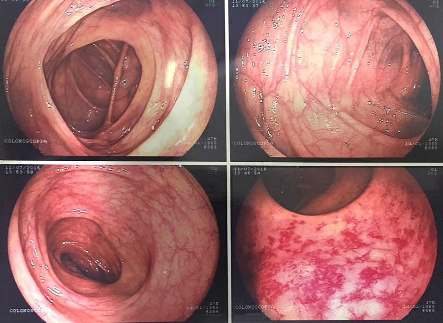

# É exagero fazer o exame de colonoscopia antes dos 50 anos de idade?

O câncer de cólon e reto apresentou um grande aumento em incidência e já é um dos tumores mais comuns em homens e mulheres no Brasil. Mais pertu  rbador, há clara indicação de que estamos assistindo a uma mudança no perfil d  os pacientes, com pessoas mais jovens apresentando a doença. 

Há clara indicação de que estamos assistindo a uma mudança no perfil dos pacientes, com pessoas mais jovens apresentando a doença. Rastreamento é o nome que se dá aos exames que buscam reconhecer uma doença em pessoas sem sintomas. Um exemplo bem conhecido é a realização da mamografia para tentar identificar o câncer de mama em suas fases mais iniciais. No caso do colo uterino e do cólon (intestino), o rastreamento vai um pouco além e pode diagnosticar lesões precursoras, isto é, que podem se tornar câncer. 
Os testes mais utilizados para o diagnóstico do câncer de cólon são, pesquisa de sangue oculto nas fezes, enema baritado, retossigmoidoscopia flexível, colonoscopia virtual e a colonoscopia. Entre esses, há uma predileção no meio médico pela colonoscopia, já que ela permite, além da visualização direta do intestino, a remoção de eventuais pólipos, ou a biópsia de lesões suspeitas. 
O exame é feito por um especialista após um preparo intestinal, e com uma sedação leve. Sabemos que o exame, quando bem indicado, reduz a incidência de câncer de cólon em até 65%. A recomendação atual para rastreamento do câncer de cólon é iniciar a realização dos exames aos 50 anos. É claro que, se houver qualquer queixa que exija uma investigação antes dessa idade, o exame deve ser antecipado. Além disso, em famílias com muitos casos da doença, ou com síndromes hereditárias já diagnosticadas, a idade para início dos exames pode ser antecipada, e a frequência do exame revista de acordo com o risco reconhecido. 
A idade de 50 anos foi estabelecida para o início das avaliações periódicas, independentemente do método a ser utilizado. Sabe-se que esse tipo de tumor costuma se iniciar como um pólipo, e seu tempo de formação é mais longo. Como a idade usual para seu aparecimento é após os 65 anos, a idade adotada para início do rastreamento é bastante adequada. A repetição do exame pode ser espaçada – uma colonoscopia a cada dez anos conseguiria “interceptar” o problema na maioria dos casos. 
Mas, se a colonoscopia é tão eficiente e estamos vendo mais casos em jovens, por que não iniciar o rastreamento colonoscópico mais cedo? A resposta é complexa. Primeiro, é importante ressaltar que, mesmo após a recente mudança no perfil dos pacientes, apenas uma minoria dos casos (menos de 15%) ocorre em pessoas com menos de 50 anos. Além disso, não temos hoje no país médicos, equipamentos e infraestrutura suficientes para fazer colonoscopias de rotina em todas essas pessoas. Mais importante, a colonoscopia não é isenta de risco, existe uma taxa de complicações com o exame ao redor de 1,5%. Os eventos mais comuns são reações a anestésicos, perfurações intestinais, sangramentos e infecções. Embora o porcentual seja baixo, quando o exame é realizado em milhões de indivíduos, o número absoluto torna-se relevante. 
Todo procedimento oferecido a um paciente deve proporcionar mais benefícios do que riscos, e essa relação se torna menos atrativa quando o teste é oferecido a uma população de risco menor. Ou seja, um paciente jovem tem os mesmos riscos de desenvolver complicações que um indivíduo com mais de 50 anos, mas se beneficia menos da realização do exames, visto que a probabilidade de ter a doença é significativamente menor. 
Concluindo, a colonoscopia pode e deve ser feita em pessoas com sintomas que indiquem uma possível doença intestinal, particularmente em casos de sangramento intestinal, independentemente da idade. No rastreamento de pessoas assintomáticas, no entanto, a colonoscopia ainda deve ser considerada apenas para pacientes com mais de 50 anos. Pessoas com risco familiar aumentado devem discutir a idade de início dos exames com seus médicos. 

Mas a verdade é que essa discussão deve se tornar obsoleta num futuro próximo. Isso porque já existem testes para detectar a presença de DNA de câncer de cólon e reto nas fezes. Como são muito recentes, e seus dados de efetividade ainda limitados, a maioria dos especialistas prefere não recomendá-los como rotina. No entanto, sua acurácia deve melhorar com o tempo, e no futuro devem substituir as outras modalidades. A colonoscopia continuará existindo, mas como ferramenta complementar nos casos em que o teste for positivo, para remover ou biopsiar áreas suspeitas.
