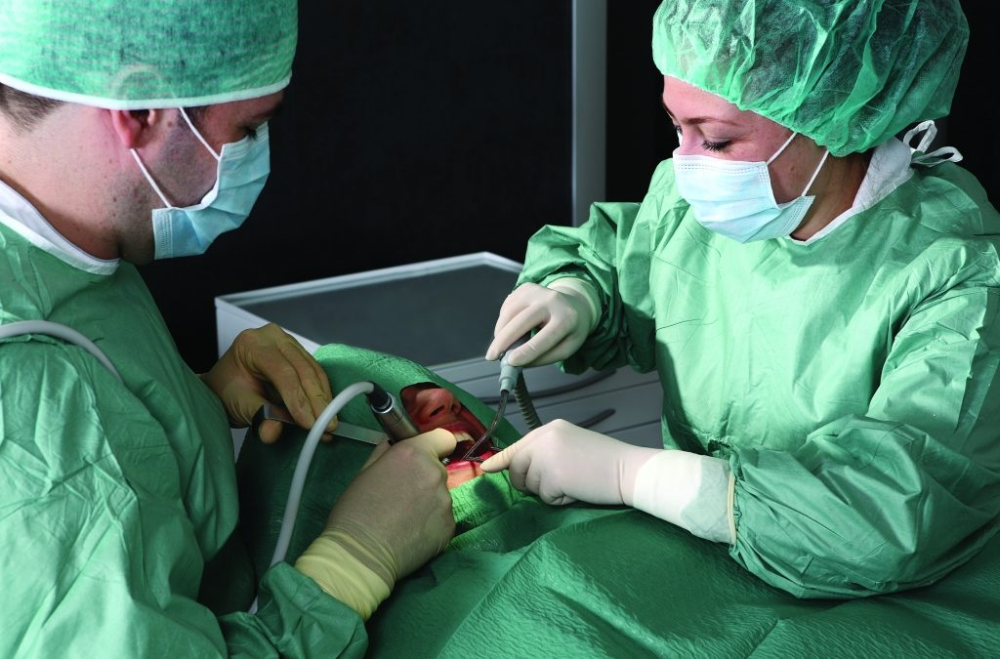

# O quê faz o cirurgião buco-maxilo-facial?

O cirurgião especialista em Cirurgia e Traumatologia Buco-Maxilo-Faciais é um profissional da Odontologia que tem pós-graduação realizada em ambiente ambulatorial e hospitalar, por isso, tem amplo conhecimento sobre os traumas de face, patologias maxilofacias, cirurgias necessárias para as correções das deformidades da face, distúrbios da articulação têmporo-mandibular entre outras atuações. 

Os tratamentos necessários nessa especialidade têm cobertura obrigatória pelos convênios médicos e pelo SUS. Cabe a você escolher o profissional mais capacitado para condução do seu caso. 

Caso você não tenha convênio médico, esses tratamentos também são oferecidos pela rede pública de saúde (SUS) em ambiente ambulatorial e/ou em ambiente hospitalar. Dependendo da sua necessidade algumas Faculdades de Odontologia, públicas ou privadas, também oferecem tratamentos coadjuvantes que auxiliam no seu eventual tratamento hospitalar. Normalmente são tratamentos realizados por alunos sob supervisão dos seus professores. Procure na sua região as Faculdades de Odontologia mais próximas que oferecem esse serviço. 

Para cirurgias ambulatoriais algumas Prefeituras disponibilizam centros de especialidade que podem oferecer também esse serviço em Cirurgia Maxilofacial. É importante verificar essa disponibilidade junto à Prefeitura da sua região. 

Para as cirurgias em âmbito hospitalar, alguns hospitais da rede pública e saúde oferecem esse serviço. Normalmente são hospitais que oferecem programas de Residência hospitalar em Cirurgia e Traumatologia Buco Maxilo Facial.
