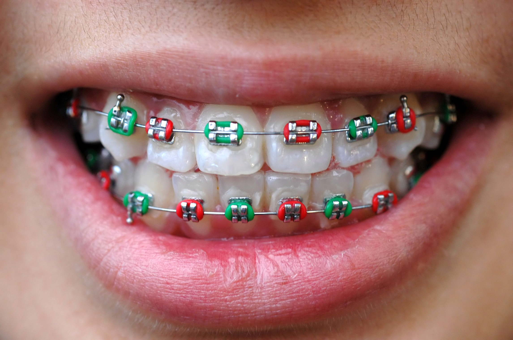

# APARELHO ORTODÔNTICO: OS DIFERENTES MODELOS E SUAS FUNÇÕES

Quem usa aparelho ortodôntico sabe que ele acaba se tornando um acessório de beleza, como os óculos, por exemplo. Por isso, de acordo com a vaidade de cada pessoa, a cor e modelo escolhidos fazem toda diferença. Os aparelhos podem ser prateados, coloridos, transparentes ou até mesmo invisíveis. "Existem inúmeros tipos para cada tipo de má oclusão, mas podemos genericamente dividir em aparelhos fixos e móveis que podem ter efeitos nos dentes (ortodônticos) e na estrutura óssea que sustenta os dentes (ortopédicos)" explica o ortodontista Mário Ito. Para conhecer quais são as opções de aparelhos ortodônticos, veja as definições do profissional.  

# APARELHO FIXO

Esse é o tipo mais comum. A estrutura do dispositivo é composta por bandas, fios e/ou braquetes. O objetivo do aparelho é fazer com que os dentes sejam puxados, movendo-se gradualmente em direção à posição correta. "Por não permitir a remoção, não dependemos muito da colaboração ou utilização por parte do paciente para obter resultados efetivos. Com esse aparelho conseguimos movimentos precisos dos dentes, porém exige um cuidado maior na sua higienização", explica o expert em aparelhos. Além disso, o profissional ressalta que os aparelhos fixos atuais estão muito mais anatômicos e confortáveis para a boca.

# APARELHO FIXO ESTÉTICO

Possui a mesma função que o aparelho de metal, corrigir dentes tortos e desalinhados. Porém, esse modelo é feito de materiais transparentes, mantendo assim uma melhor estética quando comparado ao metálico. Os braquetes são feitos, em geral, de policarbonato, porcelana ou safira. Além de super discreto, eles não desgastam e proporcionam mais segurança e beleza ao sorriso do paciente. A procura por esse tipo aumenta constantemente. É uma excelente opção para quem quer e precisa corrigir a má formação sem deixar de lado a estética e a aparência.

# APARELHO MÓVEL

Muito eficaz para crianças com ou sem dentição definitiva. Em geral, até uns 12 anos de idade é aconselhável esse tipo de aparelho. Explicando de uma forma bem simples, o aparelho móvel tem a função de manter os dentes na posição certa, por isso, ele é indicado após a retirada do aparelho fixo para conter o desalinhamento dos dentes. Mesmo que seja móvel, seu uso deve ser constante. Deixar de usá-lo regularmente pode prejudicar todo o resultado do tratamento. Fique esperto!

# EXPANSOR PALATINO

Muita gente nem conhece, mas o expansor palatino é também um tipo de aparelho. "Esse modelo promove um ganho transversal na largura do palato (céu da boca) sendo indicado em jovens para corrigir mordida cruzada, ou seja, quando a região posterior do arco superior estão estreitos em relação ao inferior, além de ganho de espaço para dentes anteriores apinhados", explica Mário. 
Para obter o mesmo resultado em adultos, muitas vezes é necessária uma intervenção cirúrgica. Por isso, insistimos na velha máxima de que quanto mais cedo for tratado, melhor. "A procura do tratamento ortodôntico pelos pais para os seus filhos está cada vez mais consciente, seja pela indicação do odontopediatra ou pelo seu médico pediatra. Mas o bom é que não temos idade "máxima" para começar a correção, os adultos também se beneficiam com tratamentos mais eficientes e estéticos", comentou o profissional.

# APARELHOS ALINHADORES

Mais usado em tratamentos odontológicos estéticos, os alinhadores são quase invisíveis e bastante sofisticados feitos sob medida. São produzidos através de softwares que permitem visualizar os planejamentos e resultados pretendidos. Bem legal, não é? Os alinhadores promovem um tratamento não só higiênico, mas estético, com menos dores e mais eficiência nos resultados. 
Essa também é uma boa opção para as pessoas que apresentaram alguma rejeição relacionada ao metal ou, especificamente, ao níquel que existe em aparelhos metálicos, provocando inflamação excessiva na gengiva. " Essas rejeições pode ser contornadas com o uso desses alinhadores que seria o ideal devido a ausência de partes metálicas", indicou.

# APARELHO LINGUAL

Para casos mais simples, de curta duração, o aparelho lingual costuma ser o mais indicado. Ele também é considerado um aparelho da ortodontia invisível, já que os braquetes são colados na parte interna dos dentes, ficando em contato com a língua, ou seja, os dentes escondem o uso do acessório. Sua funcionalidade é a mesma de um aparelho fixo. Além do ganho estético, o modelo é utilizado por praticantes de esportes de maior contato, já que uma pancada na região da boca pode provocar traumas ocasionados entre o impacto e o aparelho e, com isso, cortar a boca.

# TRATAMENTO E CUIDADOS PARA SEU APARELHO ORTODÔNTICO

Agora que você já conhece melhor sobre cada tipo de aparelho, é hora de conversar com seu dentista para entender qual se encaixa melhor no seu tratamento e, claro, na sua arcada dentária. Afinal, independente do tipo escolhido, o importante é realizar o tratamento de forma adequada, com consultas periódicas ao dentista e cuidados com a higiene, incluindo sempre o aparelho nessa limpeza. As escovas interdentais são ótimas opções para quem usa aparelho, consulte seu dentista para mais informações.
