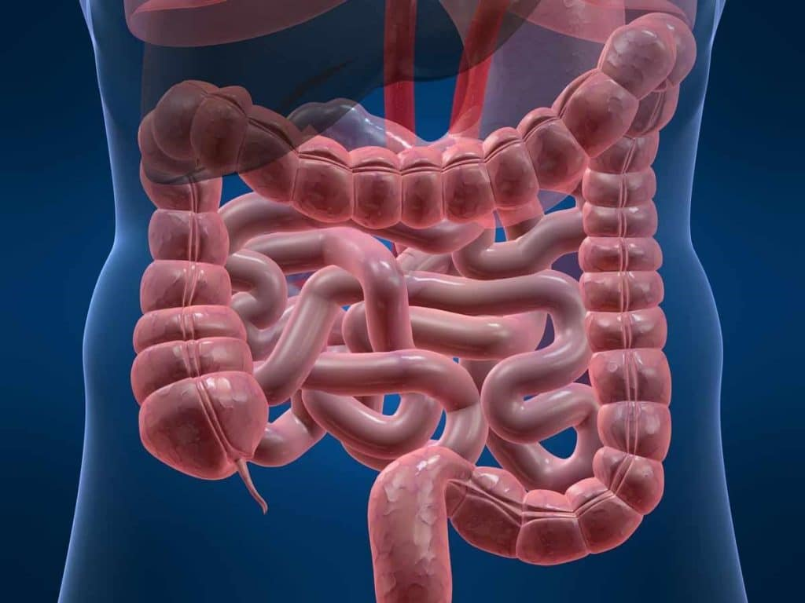

# Coloproctologista, afinal o que faz o médico dessa especialidade

Quando se fala em coloproctologia, quase todo mundo logo associa essa especialidade médica ao exame de próstata. Mas na verdade, esse médico cuida de outros problemas. No caso do exame de toque, é preciso ir ao urologista.Então, quando é necessário procurar atendimento com um coloproctologista? Continue a leitura para entender o que faz o médico da área e quais são as doenças tratadas por ele. Saiba mais! 

# Qual a formação do Coloproctologista?

A coloproctologia é a área que estuda as doenças do intestino (cólon), do reto e do ânus. Esse médico é chamado de coloproctologista, ou cirurgião colorretal, conhecido popularmente também como proctologista. 
Para se especializar nessa área, o médico deve fazer uma residência em cirurgia geral, com duração de 2 a 3 anos. Depois, é necessário fazer outra especialização — em coloproctologia —, por mais 1 ou 2 anos. Ou seja, trata-se de um profissional extremamente capacitado e preparado para realizar consultas, exames e cirurgias. 
É uma das especialidades médicas mais antigas, com registros históricos de mais de 5 mil anos. Ela é reconhecida pelo Conselho Federal de Medicina e a Associação Médica Brasileira. A Sociedade Brasileira de Coloproctologia representa os médicos da classe. 

# O que trata essa especialidade?

Ainda que muitas vezes se procure um gastroenterologista ou clínico geral, o proctologista é o médico mais indicado para tratar diversas doenças intestinais, do reto e do ânus. Algumas das mais comuns são: 
hemorroidas e incontinência anal; 
fissuras anais; 
câncer no intestino grosso e no reto; 
doença de Crohn; 
inflamações, como diverticulite e retocolite; 
infecções intestinais; 
tumores benignos; 
diarreia ou constipação crônicas; 
síndrome do intestino irritável; 
pólipos, fístulas e abscessos; 
doenças sexualmente transmissíveis no reto e ânus.

 # Quando procurar esse profissional?

Pela confusão com a área de atuação do urologista, muita gente não sabe quando procurar um ou outro médico. O urologista é responsável pelo sistema urinário e pelo sistema reprodutor masculino. Ou seja, se ele pede um exame de próstata, o procedimento pode ser realizado por ele mesmo ou o paciente pode ser encaminhado para um proctologista, pois a próstata é alcançada pelo ânus. 
No entanto, as doenças relacionadas ao ânus, intestino e reto, são tratadas pelo coloproctologista. Assim, deve-se procurar esse profissional sempre que for diagnosticado um problema nessas áreas — ou na ocorrência dos seguintes sintomas: 
dificuldade para evacuar; 
constipação intestinal; 
diarreia persistente por mais de 3 semanas; 
dor e cólica frequentes na região abdominal; 
sangramento anal; 
qualquer alteração no funcionamento do intestino; 
histórico de câncer intestinal ou retal na família. 
Por mais simples que o sintoma possa parecer, ele pode ser um indicativo de um problema mais grave, como a Doença de Crohn ou a diverticulite. Felizmente, a maioria das doenças colorretais tem cura ou tratamento, seja por meio de medicamentos ou pela realização de uma cirurgia. Mas o diagnóstico precoce e o acompanhamento de um médico de confiança são fatores fundamentais para ter maiores chances de cura evitar complicações. 
