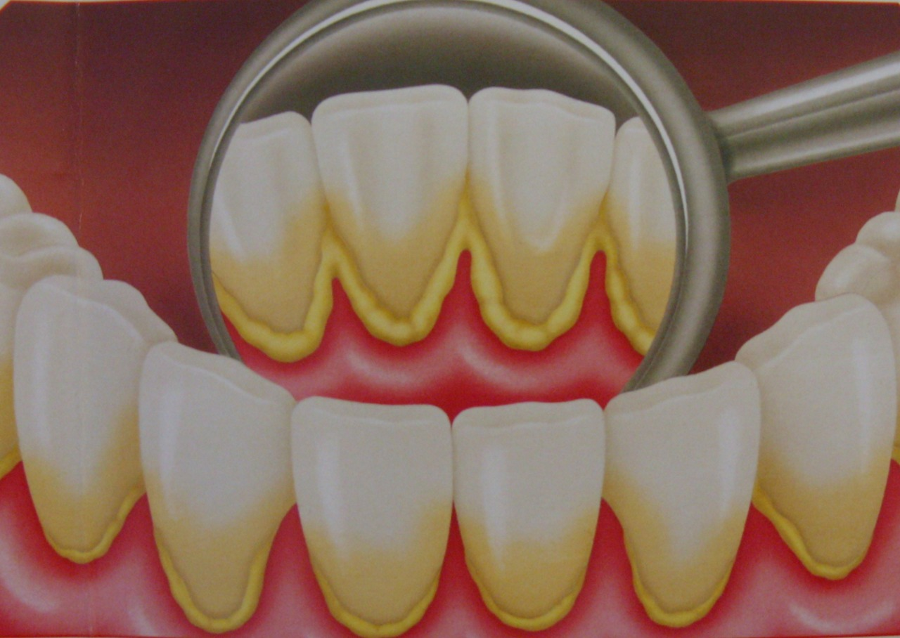

# O que é profilaxia dental?

Profilaxia dental é o nome dado à limpeza realizada pelos cirurgiões dentistas para prevenção de doenças bucais e periodontais. 
Este procedimento – que consiste na eliminação de tártaros, placas bacterianas e manchas – inclui, quando necessário, raspagem, polimento e restauração dos dentes, tornando-os mais brancos e garantindo-lhes uma superfície mais lisa.

# O tártaro e a Placa Bacteriana

O tártaro e a placa bacteriana provocam a inflamação da gengiva, também conhecida como gengivite. Quando inflamada, a gengiva fica inchada, mais vermelha e sangra durante a escovação ou, até mesmo, espontaneamente. Se nada for feito, o processo poderá evoluir para uma inflamação nos tecidos de suporte dos dentes – a periodontite -, causando perda do osso de suporte, mobilidade dental e até a perda dos dentes. 

# Periodontite

Se não for tratada, a periodontite em estado avançado pode também causar a endocardite bacteriana, que leva as bactérias instaladas nas bolsas periodontais a disseminarem-se na corrente sanguínea, alojarem-se nas válvulas cardíacas e comprometerem a circulação do sangue, o funcionamento do coração, levando até a infartes. Portanto, realizar a profilaxia periódica é essencial.

 # Remoção do Tártaro

É removido através de aparelhos de ultrassom e curetas (instrumentos para raspagem manual). O biofilme, ou placa bacteriana, é removido com jato de água+ar+bicarbonato e polimento com pastas e escovas rotatórias especiais de uso exclusivo do dentista.

# Aparelho de Ultrassom

O aparelho de ultrassom permite ajuste de potência, geralmente o desconforto causado ao paciente é mínimo. Porém, algumas pessoas possuem dentes mais sensíveis e, nestes casos, são utilizadas anestesias. A redução da quantidade de bactérias da cavidade bucal diminui as chances de que elas causem doenças e inflamações não apenas na boca, mas também no restante do corpo. 
Vale ressaltar, que a profilaxia dental não substitui a higienização, que deve ser feita diariamente pelo próprio paciente, por meio da escovação, realizada corretamente após as refeições, e utilizando o fio-dental. A profilaxia é um complemento que deve ser realizado de tempos em tempos, garantindo a remoção dos resíduos e placa formada por limitações da limpeza caseira. 
Os resultados da profilaxia são dentes visivelmente mais claros, limpos e com superfície lisa, além da melhora na aparência bucal, uma vez que manchas amareladas de café, chá, chimarrão e nicotina (no caso de fumantes) são removidas. A limpeza realizada pelos cirurgiões dentistas contribui, ainda, para saúde bucal e incentiva a vontade do paciente de manter seus dentes limpos e higienizados e a boca com hálito fresco e saudável. 
Uma vez que a formação de placa bacteriana é um processo dinâmico, não existe um prazo determinado adequado para a realização da profilaxia. Por isso, é recomendada a consulta semestral com o dentista para a identificação da necessidade e periodicidade ideal para a realização da limpeza dentária.
